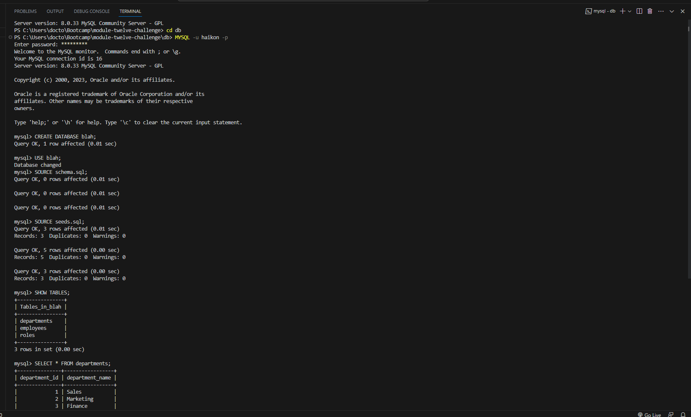

# SQL Challenge: Employee Tracker

Sadly, time constraints prevented this exercise from being completed. What you see is a meager fraction of what would have been accomplished, given more time.

## Usage instructions

Go change into the `db` subdirectory, and use your MySQL and do the following:

* login to MySQL

* CREATE DATABASE bloop;

* USE bloop;

* SOURCE schema.sql;

* SOURCE seeds.sql;

(You don't have to name it `bloop`; you can name it anything)

* logout of MySQL

* pretend there's a whole, complete app, with a front end and everything

## Screenshot

Some SQL interaction in my VSCode terminal:

## Heroku Link

As of the initial release, the app is non-functional, but this link will demonstrate functionality as soon as future updates are made:

https://dashboard.heroku.com/apps/module-twelve-challenge/deploy/github
